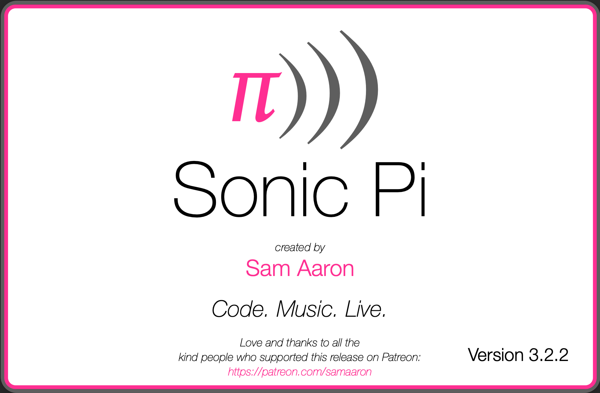
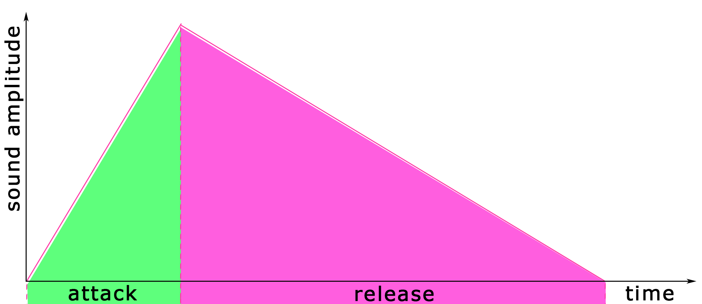

# 灵魂拷问: 你喜欢电子音乐吗?

---

## 何不用程序员的方式编写属于自己的电子音乐

## sonic pi 可以达成这一愿望

---



---

## 弹奏一个音符

`play 59`

如果有对应的音乐基础, 可以使用传统写法

`play :B3` 以上等价

---

## 音符调整



`play 59, pan: 1, attack: 2, release: 3`

类似的可调整参数还有很多...


---

## 和弦

大和弦(major chord):

```
synth :piano
play :C
play :E
play :G
```

---

## 旋律

```
play 55
sleep 1
play 65
sleep 1
play 69
sleep 1
```

这么写感觉好啰嗦, 我们可以简化一下

`play_pattern_timed [55, 65, 69], [1, 1, 1]`

---

## 重复

```
2.times do
  play_pattern_timed [55, 65, 69], [1, 1, 1]
end
```

---

## live loop

想拥有一整个乐队吗? 试试 live loop, 贝斯手和鼓手就位

```
live_loop :drums do
  sample :drum_heavy_kick
  sleep 1
end

live_loop :bass do
  use_synth :dsaw
  play :a2, attack: 1, release: 2, amp: 0.3
  sleep 2.5
  use_synth :tech_saws
  play :a1, attack: 1, release: 1.5, amp: 0.8
  sleep 1.5
end
```

---

## 合成器

本身内置大量合成器, 魔幻的银翼杀手风合成器炸聋😝

```
use_synth :blade
```

---

## 效果器

```
with_fx :reverb do
  play 50
  sleep 0.5
  sample :elec_plip
  sleep 0.5
  play 62
end
```

---

## 声音样本

```
sample :elec_plip
```

---

## 随机化

```
loop do
  play [:C, :E, :G].choose
  sleep [0.25, 0.25, 0.5, 1, 2].choose
end
```

---

## 组合在一起

找了一些比较不错的曲子, 包含源码, 有兴趣的同学可以去参考一下.

[Coding Music with Sonic Pi @juliecameron](http://www.juliecameron.com/blog/2015/11/09/coding-music-with-sonic-pi/)